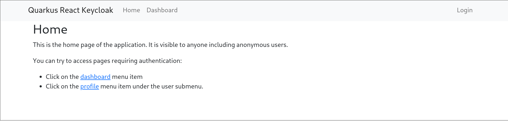
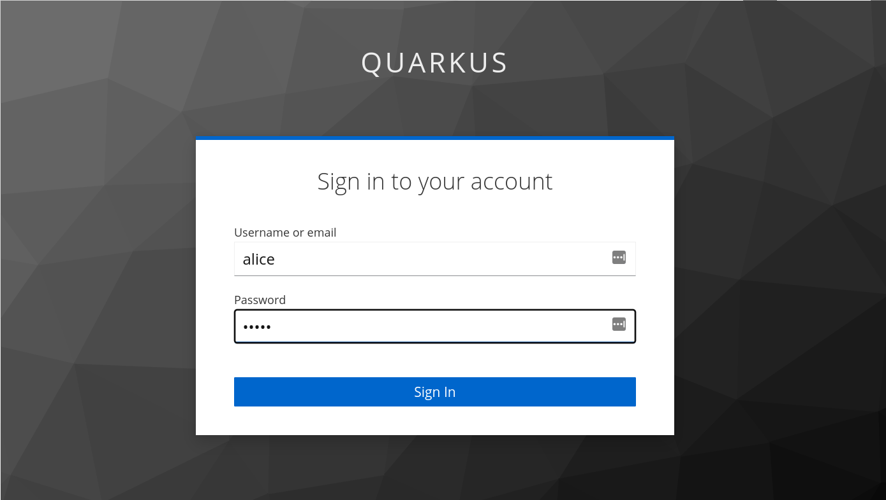
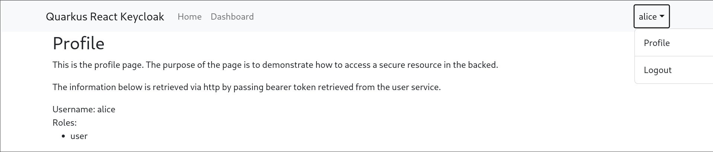

# Quarkus React Keycloak

A Quarkus Quinoa application with a react based frontend that showcases Keycloak authentication and DevServices support.

## Features

- Single page application setup
- Keycloak automatic discovery
- Keycloak auto-configuration (for dev mode)
- Authentication interceptor in the fronted / backend communication.

## Running 

The easiest way to start the application is via dev mode:

```
./mvnw quarkus:dev
```

### Launching the UI

#### Home page

Open the page at: `http://localhost:8080`



#### Login page
By clicking either the `dashboard` link or the `login` button the login screen appears:



On the login screen the credentials are:

- Username: `alice` 
- Password: `alice`

#### Profile page
By clicking either the `profile` button in the user submenu (on the right), you can access a protected screen:



